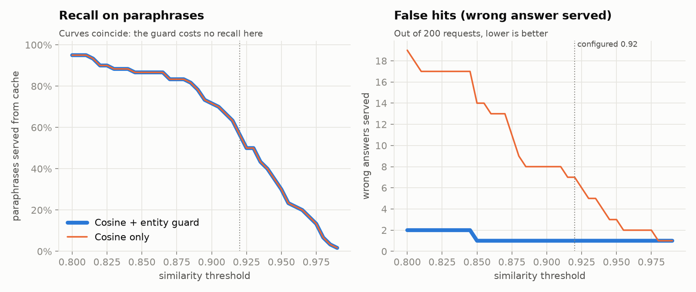
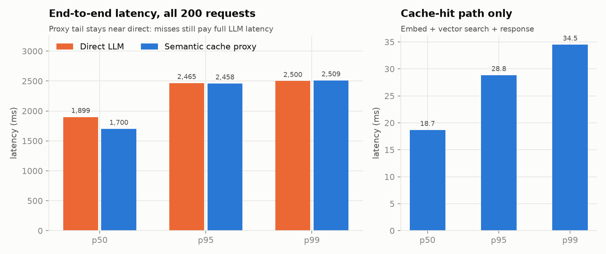
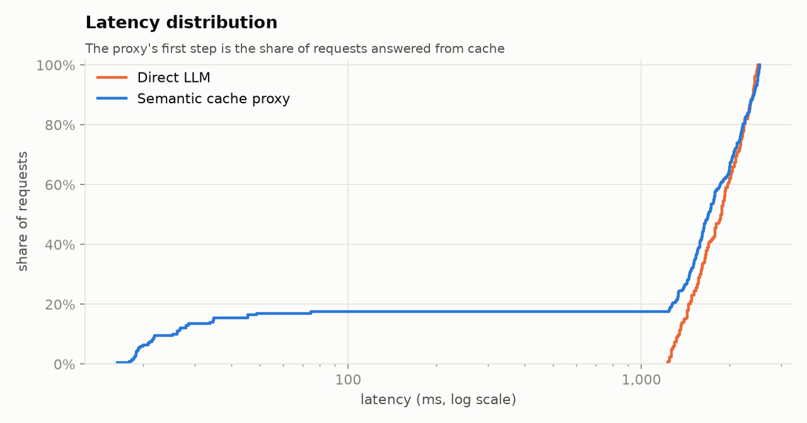
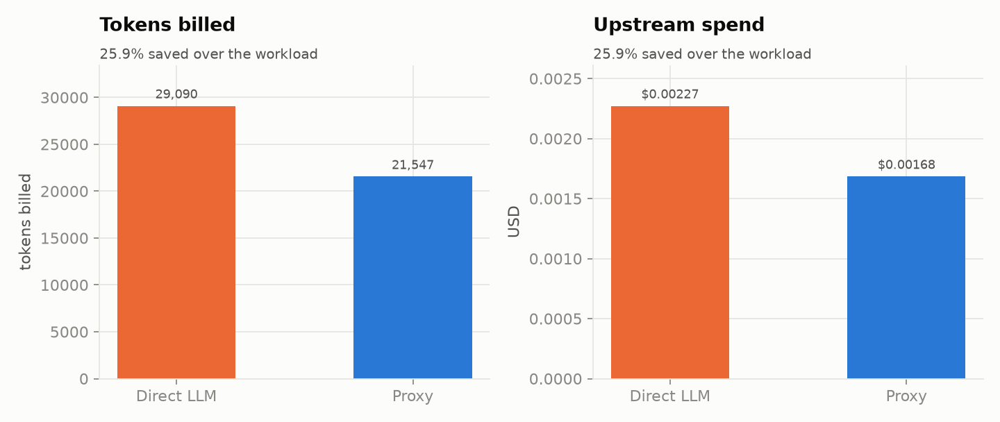

# Semantic Caching Proxy

An OpenAI-style `/v1/chat/completions` proxy that answers repeated *meanings*, not just repeated strings. Each prompt is embedded locally with FastEmbed (`BAAI/bge-small-en-v1.5`, ONNX on CPU) and searched in Qdrant. Close matches are answered from cache in ~15–25 ms. Everything else goes to the upstream LLM (Groq, OpenAI, Ollama or a mock), and the answer is stored for next time.

```
client ──POST /v1/chat/completions──▶ FastAPI proxy
                                        │ 1. embed latest user turn         (~8 ms)
                                        │ 2. top-k search in partition      (Qdrant)
                                        │ 3. score ≥ threshold AND entity guard passes?
                                        ├── yes ─▶ cached answer  (CACHE_HIT, ~15–25 ms)
                                        └── no  ─▶ upstream LLM ─▶ store ─▶ answer (UPSTREAM_LLM)
```

## What's beyond a minimal cosine cache

| Concern | What this does |
|---|---|
| **Wrong-entity hits** | Cosine similarity ignores the one word that changes the answer: *"reverse a linked list in **Python**"* vs *"…in **Java**"* scores **0.979**. An **entity guard** compares languages/tools, numbers, acronyms and proper nouns before serving a hit, and falls through to the next candidate if they differ. |
| **Isolation** | Hits are served only within the same **tenant** (`X-Tenant-ID` header or the OpenAI `user` field), **model** and **system prompt**. |
| **TTL** | Entries older than `CACHE_TTL_SECONDS` are never served, and a background loop deletes them. |
| **Capacity eviction** | Above `CACHE_MAX_ENTRIES`, the least-recently-*accessed* entries are evicted (hits update `last_accessed` after the response is sent). |
| **Non-blocking** | Embedding and Qdrant calls run in a threadpool behind a lock, and the upstream call uses async httpx. The event loop is never blocked. |
| **Baseline** | `X-Cache-Bypass: true` skips embed, lookup and store: the direct-LLM path through the same stack. |

## Setup (Anaconda)

Use the `LLM-project` conda env (Anaconda Navigator → Environments → LLM-project → Open Terminal):

```bash
conda activate LLM-project
pip install -r requirements.txt
copy .env.example .env
uvicorn main:app --port 8000
```

The first start downloads the ~130 MB embedding model. With `UPSTREAM_PROVIDER=mock` (the default), no API key is needed. Upstream latency is simulated at 1.2–2.5 s.

For real calls, set `UPSTREAM_PROVIDER=groq` and `UPSTREAM_API_KEY=...` (or `openai`, `ollama`, or any OpenAI-compatible `UPSTREAM_URL`).

```bash
curl -s localhost:8000/v1/chat/completions -H "Content-Type: application/json" -d "{\"messages\":[{\"role\":\"user\",\"content\":\"Why does Earth have seasons?\"}]}"
curl -s localhost:8000/v1/chat/completions -H "Content-Type: application/json" -d "{\"messages\":[{\"role\":\"user\",\"content\":\"What causes the seasons on Earth?\"}]}"
```

The second call scores 0.917, which is a hit at `SIMILARITY_THRESHOLD=0.88` but a miss at 0.92 (see below).

Other endpoints: `GET /cache/stats`, `POST /cache/evict`, `DELETE /cache`, `GET /health`.

## Benchmark

200 requests: 120 unique questions, 60 paraphrases of them (30%), and 20 **entity swaps** (same wording, different subject), which should miss. Concurrency is 10, and the upstream is the mock.

```bash
python -m benchmark.threshold_sweep                      # offline, no server needed
python -m benchmark.run_benchmark --url http://localhost:8000
```

### Threshold: 0.92 is too strict for bge-small



- **Cosine only** at 0.92 serves 7 wrong answers out of 200. Getting that down to 1 needs a 0.98 threshold, and by then paraphrase recall is 7%.
- **With the entity guard**, false hits stay at 1 from 0.85 upward, and recall is unchanged. That makes the threshold a recall knob instead of a precision/recall trade-off.
- The one remaining false hit is *Celsius→Fahrenheit* vs *Fahrenheit→Celsius* (0.997). Both queries mention the same entities, only in reverse order, so a set comparison can't tell them apart.

### Live runs

| | threshold 0.92 | threshold 0.88 |
|---|---|---|
| Cache hits / 200 | 35 | **51** |
| Paraphrase recall | 56.7% | **83.3%** |
| False hits | 1 | 1 |
| Hit latency, server p50 / p95 | 16.5 / 38.9 ms | 14.2 / 24.4 ms |
| Mean latency, direct → proxy | 1858 → 1561 ms (−16%) | 1895 → 1418 ms (**−25%**) |
| Upstream tokens / cost saved | 17.8% | **25.9%** |

The spec's 0.92 threshold is still the default. The data supports `SIMILARITY_THRESHOLD=0.88` with the guard on. The sweep and the live run use the same dataset, so check it against your own traffic.




**p50 / p95 / p99 barely move**, and that's expected: with 17–25% hits, the median and tail requests are still misses that pay full LLM latency. The gain appears in the mean, in the lower part of the CDF, and in cost. Hit rate is bounded by how repetitive your traffic is; this workload caps it at 30%.



Cost uses `--input-price 0.05 --output-price 0.08` USD per 1M tokens (pass your provider's current rates). Mock token counts are estimated at ~4 chars/token. Against a real provider, reported `usage` is used.

## Scaling note: embedded vs server Qdrant

Embedded Qdrant (`QDRANT_PATH`, no Docker) evaluates payload filters in Python, point by point. Measured filtered lookup cost:

| entries | 300 | 2,000 | 10,000 |
|---|---|---|---|
| filtered lookup | 6 ms | 37 ms | 183 ms |

The partition is therefore a single hashed keyword (the original three separate conditions were 2.6× slower), and embedded mode defaults to `CACHE_MAX_ENTRIES=2000`.

For larger caches, run `docker compose up -d` and set `QDRANT_URL=http://localhost:6333`. The proxy then creates payload indexes and filters TTL inside the search. *Server mode hasn't been benchmarked here yet.*

## Layout

```
app/config.py      env settings
app/cache.py       SemanticCache: embed, lookup (partition + TTL + guard), store, LRU/TTL eviction
app/guard.py       entity guard
app/upstream.py    OpenAI-compatible client + mock
app/main.py        FastAPI routes
benchmark/         dataset, live benchmark, offline threshold sweep, charts, results/
tests/             pytest suite (fake embedder, no model download)
```

## Known limits

- The cache key is the **latest user turn**, plus the system prompt. Earlier turns of a multi-turn conversation aren't part of it.
- `temperature` is ignored; a cached answer is returned even for high-temperature requests.
- Concurrent identical misses each call upstream (no request coalescing).
- The entity guard is lexical. It can't detect reversed relations (A→B vs B→A) or unlisted lowercase entities like `sin` vs `cos`.
